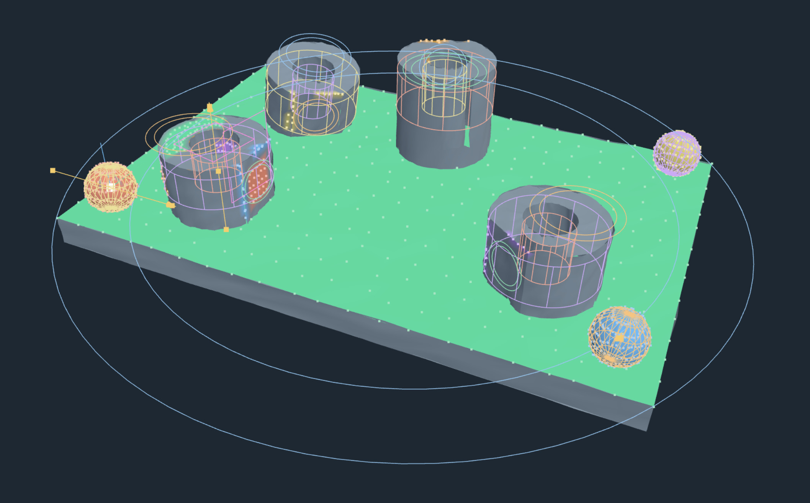
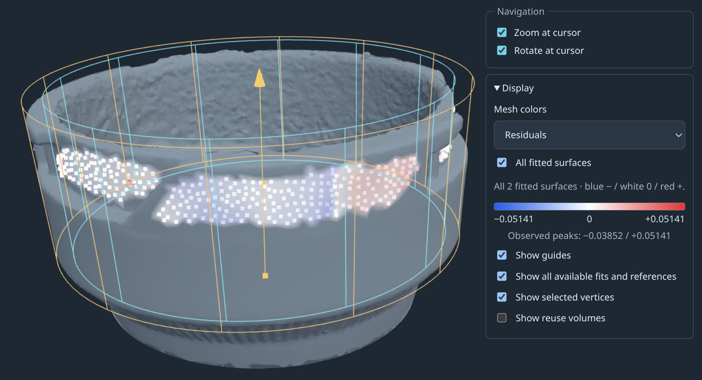

# Scansor

Scansor is an exploratory tool for fitting user-declared geometric models to
scan observations. It keeps selections, analytic primitives, reference geometry,
exact relationships, reuse lineage, residuals, and output coordinates explicit
instead of treating scan-to-CAD as an opaque automatic conversion.

[](https://youtu.be/oP44yI9DAoE)

**[Watch the narrated Scansor prototype demonstration](https://youtu.be/oP44yI9DAoE)**

The current local browser prototype demonstrates:

- retained and editable mesh selections;
- plane, cone, cylinder, and sphere fits;
- explicit point, axis, plane, and coordinate-frame datums;
- exact relationships, rotational and mirror symmetry, and joint solving;
- reusable selection volumes that seed fresh local fits on repeated features;
- signed residual inspection with a numeric color scale; and
- measured output scale, coordinate transforms, and STEP export bundles.



## Status

Scansor remains a concept-stage project with an implemented exploratory
prototype. It is not a supported product, a universal automatic scan-to-CAD
system, or evidence of physical metrology accuracy. The checked-in examples and
recipes exercise specific interaction and solver ideas; their formats are not
yet compatibility promises.

The browser experiment runs locally. Scan geometry, selections, and fits are not
uploaded to an external service.

## Run the browser prototype

Install the locked development tools and browser assets from the repository
root:

```sh
mise install --locked
uv sync --locked
npm ci --ignore-scripts --no-audit --no-fund --prefix experiments/browser_viewer
npm run build --prefix experiments/browser_viewer
```

Open the captured-nozzle demonstration on port `8765`:

```sh
OPENBLAS_NUM_THREADS=2 PYTHONPATH=src:. uv run --locked \
  python -m experiments.nozzle_browser \
  --example examples/nozzle-bayonette-simplified \
  --recipe \
  examples/nozzle-bayonette-simplified/recipes/nozzle-selection-and-fitting-demo.json \
  --port 8765
```

Then visit <http://127.0.0.1:8765/> in a WebGL2-capable browser.

The generated repeated-boss workflow shown in the video can be reproduced with:

```sh
PYTHONPATH=src:. uv run --locked \
  python -m experiments.repeated_boss_fixture \
  --output local-inputs/repeated-boss-selection-v2

OPENBLAS_NUM_THREADS=2 PYTHONPATH=src:. uv run --locked \
  python -m experiments.nozzle_browser \
  --example local-inputs/repeated-boss-selection-v2/scan-coarse \
  --recipe \
  examples/repeated-boss-selection/recipes/repeated-boss-reuse-and-alignment-demo.json \
  --port 8765
```

Generate the fixture only once; the generator intentionally refuses to overwrite
an existing output directory. See the
[browser experiment](experiments/browser_viewer/README.md) and
[repeated-boss example](examples/repeated-boss-selection/README.md) for the full
interaction and fixture details.

## Reproducible demonstration

The video is assembled from the real browser prototype rather than a separate
mockup. Its checked-in sources include the deterministic
[browser capture](scripts/demo-video/capture.mjs),
[video renderer](scripts/demo-video/render.mjs),
[narration](docs/src/project/planning/demo-video-narration.md), and
[production instructions](scripts/demo-video/README.md). Rendered frames, speech,
and video remain external production artifacts.

## Documentation and examples

- [Project documentation](docs/src/project/index.md) — scope, architecture,
  decisions, experiments, and open questions
- [Examples](examples/README.md) — captured nozzle and generated repeated-boss
  workflows
- [Selection tools and feature graph](docs/src/project/planning/selection-feature-graph.md)
- [Reference geometry and solve graph](docs/src/project/planning/reference-geometry-and-solve-graph.md)

## License

Licensed under either of:

- Apache License, Version 2.0 ([LICENSE-APACHE](LICENSE-APACHE))
- MIT License ([LICENSE-MIT](LICENSE-MIT))

at your option.
